# pick IT up (사용자 맞춤형 채용 공고 추천 서비스✨)

### 💙 SSAFY 10기 특화 프로젝트 서울 4반 🐥F5 세희고침🐥 (2024.2.17 ~ 2024.04.04)

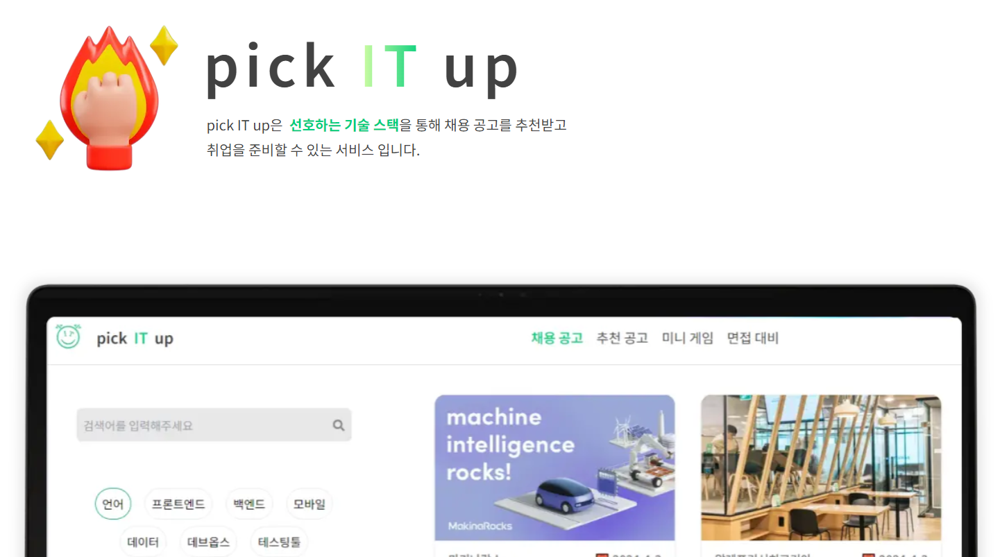

# 📜 목차

##### 1️⃣ [서비스 소개](#-서비스-소개)

##### 2️⃣ [서비스 화면](#-서비스-화면)

##### 3️⃣ [개발 환경](#-개발-환경)

##### 4️⃣ [기술 특이점](#-기술-특이점)

##### 5️⃣ [기획 및 설계 산출물](#-기획-및-설계-산출물)

##### 6️⃣ [Conventions](#-conventions)

##### 7️⃣ [팀원 소개 및 개발 회고](#-팀원-소개-및-개발-회고)

<br/>

# 서비스 소개 🎈

- 사용자 데이터 기반 IT 채용 공고를 추천해주고, 더 나아가서 해당 직군에 필요한 기술 블로그 추천

### 📌 Overview

- 사용자 데이터 기반 IT 채용 공고를 추천해주고, 더 나아가서 해당 직군에 필요한 기술 블로그 추천

### 🎯 타겟

- IT 취준생, 이직생 대상 서비스

### 📌 프로젝트 기능

### 📌 서비스 구현(✅ : 구현 완료 ❌ : 미구현)

#### 1️. 기본기능 ✅

#### 2️. 추가기능 ✅

#### 3️. 심화기능 ⚠️

</br>

- IT 직군 취업 준비생들의 관심 분야에 따른 다양한 취업 공고를 확인하기 쉽지 않음.

- IT 산업은 **빠르게 변화**하며 **새로운 기술과 트렌드**가 지속적으로 등장
  취업을 준비하는 사람들은 **관련 뉴스, 기술 개발 업데이트, 업계 동향 등을 지속적으로 추적**해야 하는 필요성 존재
  유용한 정보를 찾아내고 이를 자신의 취업 준비 과정에 효과적으로 활용하는 것은 쉽지 않음

### ✅ 서비스 설명

- 사용자 데이터 기반 IT 채용 공고를 추천해주고, 더 나아가서 해당 직군에 필요한 기술 블로그 추천

<br />

# 서비스 화면🎬
### ✨ 모든 페이지 `모바일(아이폰 12 Pro 기준 max-width:480px)` 지원

### 온보딩
- `fullpage`를 적용한 온보딩

### 회원가입 & 로그인 & 로그아웃
- 카카오, 네이버, 구글 소셜 로그인
- 자체 회원가입 및 로그인

### 채용 공고 조회
- `마감일순 정렬`로 전체 채용 공고 조회 가능
- `스크랩`하여 마이페이지에서 확인 가능

### 채용 공고 검색
- `키워드 검색` 및 `기술 스택 필터 적용`하여 검색 가능 

### 추천 공고

### 미니게임
- 사용자 경험을 위해 데이터 미제공 페이지 추가
- 정답 개수에 따라 승리 횟수 증가 및 `뱃지 획득`

#### 스피드 퀴즈
- 한 문제당 10초의 제한시간을 두고 정답 맞추기

#### OX 퀴즈

### 면접 대비
- 한 문제당 40초의 제한시간을 두고 답안 작성
- 마이페이지에서 `작성 답변` 및 `예시 답변` 조회 가능

### 마이 페이지
- `추천`을 위한 `선호 기술 스택 선택 및 변경`
- `프로필 이미지 및 기본정보 변경`
- 내가 `스크랩`한 채용공고, 유사한 항목별 `자기소개서 관리`
- `뱃지 조회`

<br />

# 개발 환경 🖥

## 🖱 Frontend


<br>


<br>

#### 상세 스택

    VScode 2023.3.4
    Version: 1.86.2 (user setup)
    Node.js: 18.17.1
    V8: 11.8.172.18-electron.0
    Nextjs : 14.1.1
    react: ^18

## 🖱 Backend


<br>


<br>


#### 상세 스택

    IntelliJ 2023.3.4
    SpringBoot 3.2.3
    Gradle 8.5
    Lombok 1.18.16
    Hibernate 3.2.1
    Swagger 4.18.2
    Spring Security 6.2.2
    Python 3.12.2
    Jupyter notebook 버전작성
    Scala 2.12.16 ( + openJDK-8u342 )
    sbt 1.7.2
    Play Framework 2.8.21
    Spark 3.0.2
    mongo-spark-connector 3.0.2

## 🖱 CI/CD


#### 상세 스택

    docker 25.0.4
    docker-compose 2.21.0
    jenkins LTS 2.440.1
<br>

## 🎨 UI/UX


<br>

## 👨‍👩‍👧 협업 툴

- <strong>형상 관리<br>
  
  

- <strong>이슈 관리<br>
  

- <strong>커뮤니케이션<br>
  
  
  
  <br>

<br />


# 기술 특이점 🧰

## 🖱 Frontend

### 1. NextJS 활용 SEO를 고려한 SSR방식 웹사이트 제작
### 2. NextJS 활용 데이터 캐싱으로 UX 향상
### 3. Zustand를 활용해 전역 상태 관리
### 4. React-query를 활용해 검색 기능 Infinite Scroll 구현
### 5. refreshToken과 accessToken으로 로그인 로직 구현

## 🖱 Backend

### ✨ 1. MySQL Master-Slave

<div align="start">
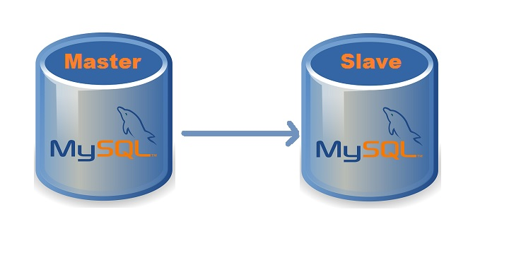
</div>

`MySQL`을 `Master DB`와 `Slave DB`로 나누어서 `분산 환경을 구축`했습니다.

DB 분산 환경을 통해 `Master DB에 장애가 발생하더라도 Slave DB를 활용해서 복구할 수 있도록` 했습니다.

또한, 읽기 작업을 Slave DB로 분산시켜서 `서비스의 응답을 향상`시키고 `대규모 트래픽에 대응`할 수 있도록 했습니다. 사용자 상호작용 데이터가 쌓이는 쓰기 작업이 DB에 부하를 줄 수 있기 때문에, 읽기 작업을 Slave DB에서 전담하도록 했습니다.

그리고 읽기와 쓰기 작업을 분리하였기 때문에 스프링 프로젝트에서도 `CQRS 패턴을 통해 Command 작업과 Query 작업을 구분해서 작업`하였습니다.

`시스템의 가용성과 성능을 향상` 시킬 수 있으며 `CQRS 패턴과 결합을 통해 시스템의 확장성`을 높일 수 있어서 개발 및 운영 측면에서 많은 이점을 누릴 수 있는 기술이라고 생각합니다.

### ✨ 2. Apache Spark (+ Scala)


<div align="start">
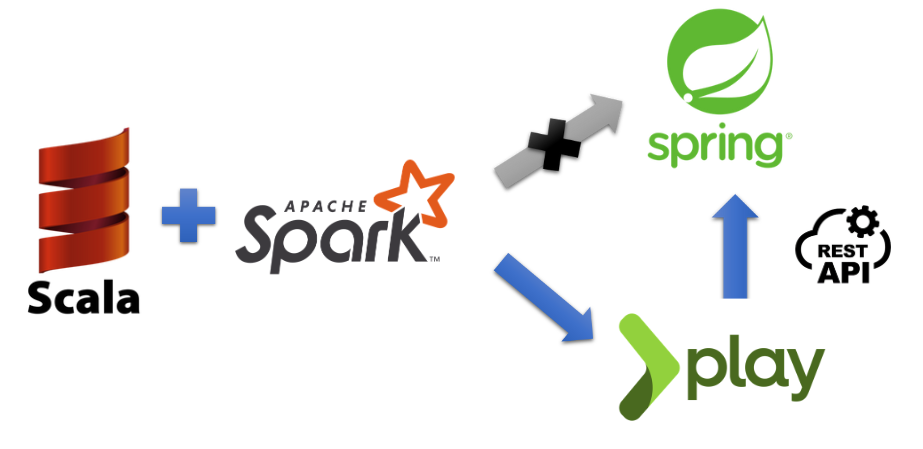
</div>

데이터 처리를 위해 `Apache Spark`를 사용했습니다. Spark 애플리케이션을 작성할 수 있는 언어로 대표적으로 Python과 Scala가 있는데, `Spark 자체가 Scala 언어로 작성`돼있고 `JVM 상에서 구동된다는 점`에서 직접적인 호환성으로 인한 비교적 우수한 성능과 높은 신규 API 커버리지와 더불어 JVM 언어의 타입 안정성 등을 고려해서 `Scala를 사용`하기로 했습니다.

메인 서버인 Spring 서버 또한 같은 JVM 언어인 Java를 사용하기 때문에 Scala로 작성된 Spark 애플리케이션 코드를 Spring 서버 상에서 실행하려 하였으나, `Spring 3.x 버전부터 JDK 17버전을 사용하고 하둡 생태계에 대한 최신 버전 지원이 중단`됨으로 인해 `하둡 생태계에 속한 Spark와의 JDK 버전 호환 문제가 발생`했고, `추천 서버를 분리`하기로 결정했습니다.

`추천 기능 서버`는 2.0 버전부터 Scala를 메인 언어로 지원하는 `경량 웹 프레임워크인 Play framework로 개발`했습니다. Spring 서버와 RESTful API를 통해 통신하며, Spring 서버로 추천 요청이 오면 Play 서버와의 HTTP 통신을 통해 추천 결과를 회신하도록 구축했습니다.

`Spark에서 읽어올 데이터를 저장할 데이터베이스`로는 대규모 데이터셋에 대한 빠른 읽기 성능을 보이며 추후 분산 환경 구축을 고려했을 때 수평적 확장에 용이한 NoSQL 데이터베이스인 `MongoDB`를 채택했습니다.

`데이터 처리`에는 `Spark Dataframe API를 활용`했습니다. Dataframe API는 `SQL과 유사한 방식으로 코드를 더 간결하고 직관적인 방식으로 작성할 수 있고 관계형 DB와 유사한 옵티마이저 기능을 제공`하기 때문에 Spark에서 기본적으로 사용되는 RDD API보다 더 나은 성능으로 데이터를 처리할 수 있다는 점에서 채택하게 되었습니다.

### ✨ 3. Jenkins CI/CD 파이프라인 고도화

Jenkins의 `Generic Webhook Trigger 플러그인 을 활용하여     백엔드 빌드/배포 파이프라인을 세분화    했습니다. 

프로젝트를 위해 주어진 `하나의 GitLab repository를 FE/BE가 공유`해야하고 `BE 내에서도 두 개의 다른 서버가 개발`되다보니 빌드/배포 파이프라인이 세분화할 필요가 있었습니다. 백엔드 서버 간의 통신으로 인해 두 서버의 브랜치를 완전히 분리해서 개발하는 데에는 제한이 있었기 때문에 `하나의 백엔드 develop 브랜치에서 각 서버 브랜치로부터 merge 이벤트의 source branch로 파이프라인을 조건부 실행하는 방법을 탐색`했고 `Generic Webhook Trigger`을 통한 방법을 찾을 수 있었습니다.

 `Generic Webhook Trigger`는 `webhook 요청 내 세부 데이터(이벤트 유형, 소스 브랜치, 타겟 브랜치 등)을 직접 활용`할 수 있기 때문에 `각 webhook 이벤트에 대해 파이프라인을 더욱 세밀한 제어권을 행사`할 수 있었고, `특정 소스/타겟 브랜치에 대한 Merge Request 이벤트(그중에서도 merged 이벤트)에 대해서만 파이프라인이 트리거되도록 설정`하여 두 서버의 빌드/배포 과정을 분리할 수 있었습니다.

또한 두 서버를 동시에 빌드할 경우 `parallel directive를 사용`하여 두 빌드 프로세스를 병렬적으로 처리하였고, 이전과 비교했을 때 `빌드 시간을 30% 정도 단축`시킬 수 있었습니다.

<br />

# 기획 및 설계 산출물 📁

### 🏛 서비스 아키택처

<div align="start">

</div>

### 🛢︎ ERD

<div align="start">

</div>

### [📄 API 명세서](https://www.notion.so/API-93984df81dd345d0bca02f77572e75e8)

<div align="start">
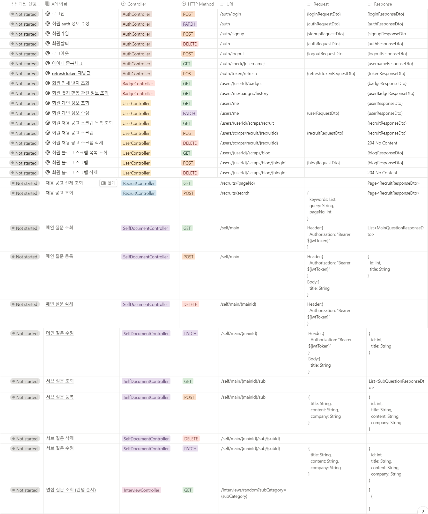
</div>

### [🎨 화면 설계서](https://www.figma.com/file/AlcgDU0rh95PABatRzry87/%F0%9F%93%B0?type=design&node-id=0%3A1&mode=design&t=TrHIwL1fd7BjdxJT-1)

<div align="start">

</div>

### 🎥 시연 시나리오

#### 로그인 및 회원가입

<div style="display: flex;">
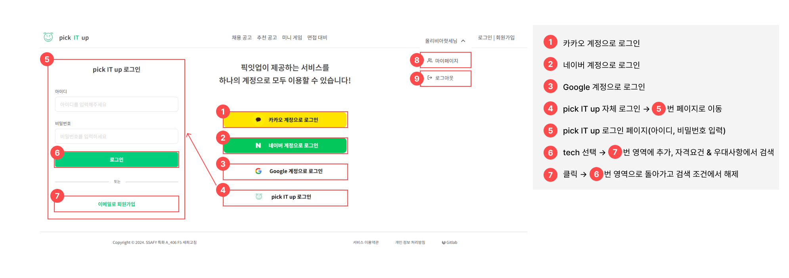

</div>

#### 채용공고

<div align="start">
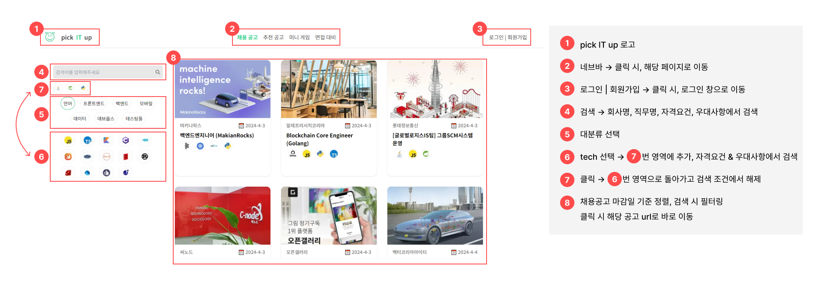
</div>

#### 추천공고

<div align="start">
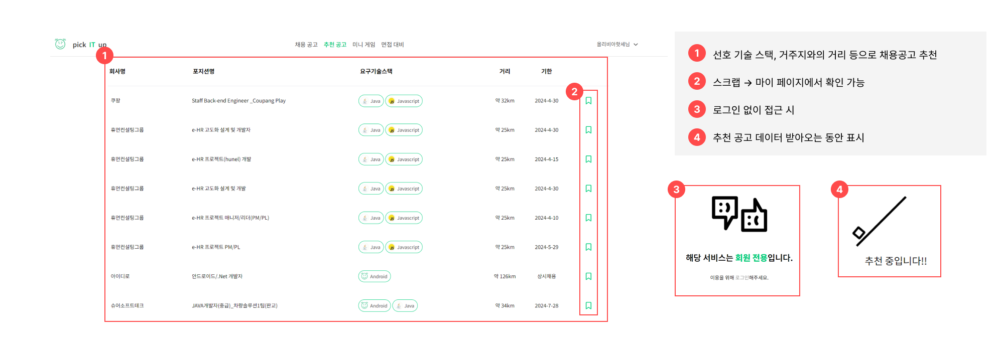
</div>

#### 미니게임

<div align="start">
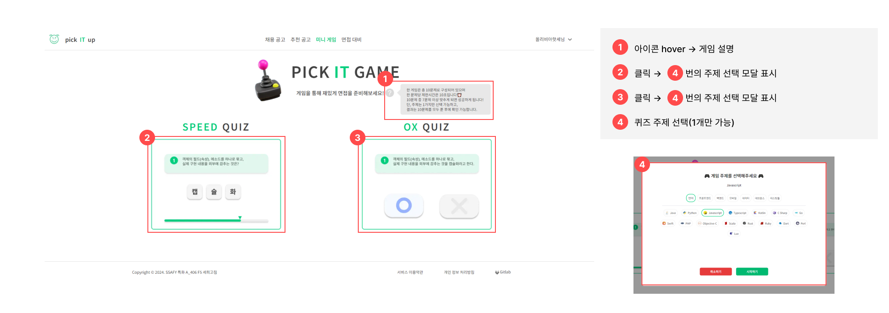
</div>

##### speedQuiz

<div style="display: flex;">
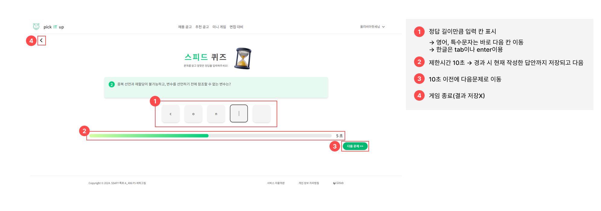
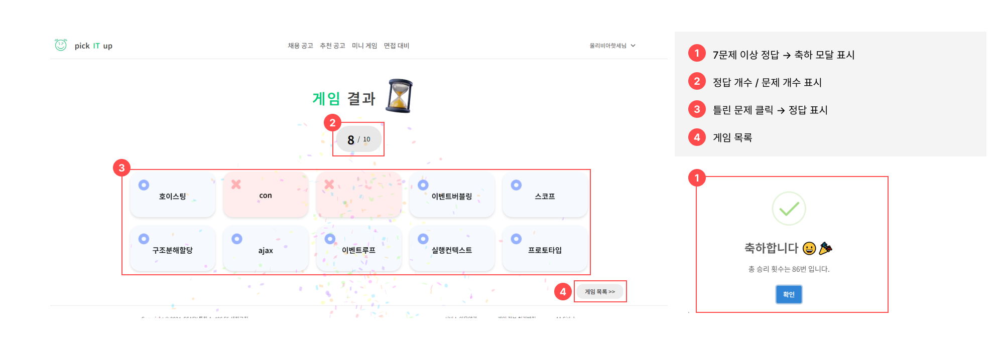
</div>

##### OXQuiz

<div style="display: flex;">


</div>

#### 면접대비

<div style="display: flex;">
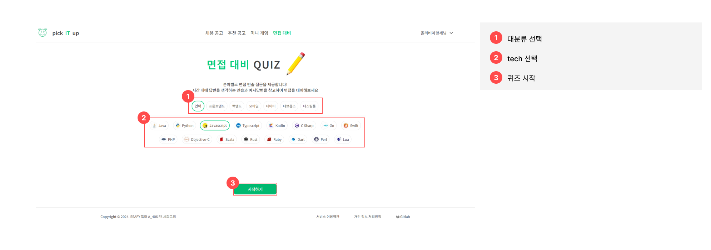
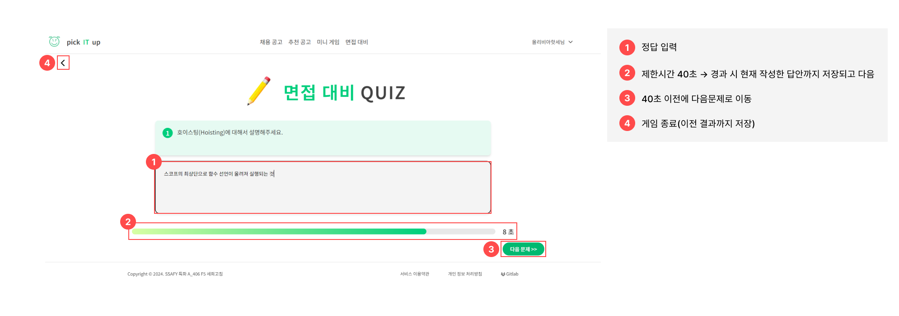
</div>

#### 마이페이지

##### 내가 찜한 채용 공고

<div align="start">
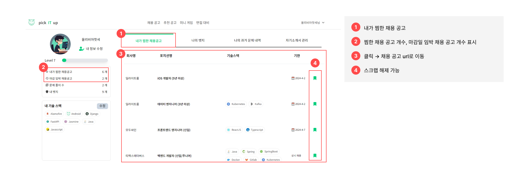
</div>

##### 나의 뱃지

<div align="start">
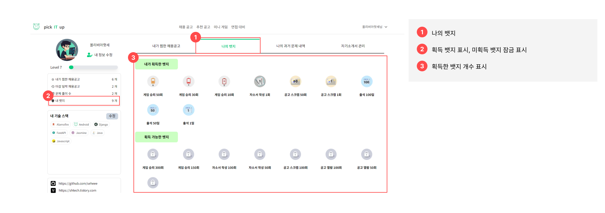
</div>

##### 과거 답변 내역

<div align="start">
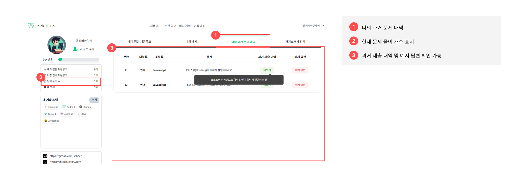
</div>

##### 자소서 관리

<div align="start">

</div>

##### 개인 정보 수정

<div align="start">
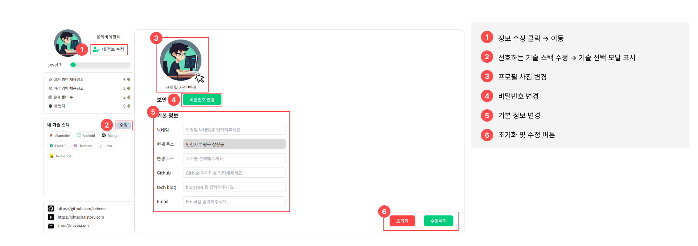
</div>

<br />

# ✨ Conventions

## 📌코드 컨벤션

[🖱 Frontend Conventions](https://www.notion.so/Front-End-59a0c5e4788245a985c65521dc8dff8a)

[🖱 Backend Conventions](https://www.notion.so/Back_End-2e25f8e764d84d929aaf5dfc0a23ba27)

## 📌커밋 컨벤션

```
✨Feat : 새로운 기능 추가
🐛Fix : 버그 수정
📝Docs : 문서 수정
🗃️Style : 코드 포맷팅, 세미콜론 누락, 코드 변경이 없는 경우
♻️Refactor : 코드 리펙토링
✅Test : 테스트 코드, 리펙토링 테스트 코드 추가
💡Comment : 필요한 주석 추가 했을 경우
🎨Design : css나 디자인 변경, 이미지 추가 등
🚑Hotfix : 치명적인 버그 수정
👷Build : 배포 관련
🤝🏻Merge : f-기능명 into dev-frontend
```

<br />

# 팀원 소개 및 개발 회고 🐥

## 📆 프로젝트 기간

### 24.02.19 ~ 24.04.04

- 기획 및 설계 : 24.02.19 ~ 24.02.28
- 프로젝트 구현 : 24.02.28 ~ 24.04.01
- 버그 수정 및 산출물 정리 : 24.04.01 ~ 24.04.04
- 코드 리팩토링 : 24.04.04 ~

<br />

## 💞 팀원 소개

<table>
    <tr>
        <td height="140px" align="center"> <a href="https://github.com/hyunsoo10">
             <br><br> 👑 조현수 <br>(Back-End) </a> <br></td>
        <td height="140px" align="center"> <a href="https://github.com/Song-YoonJae">
             <br><br> 👶🏻 송윤재 <br>(Back-End) </a> <br></td>
        <td height="140px" align="center"> <a href="https://github.com/HyeongtaekOh">
             <br><br> 👶🏻 오형택 <br>(Back-End) </a> <br></td>
        <td height="140px" align="center"> <a href="https://github.com/yhc-key">
            
            <br><br> 👶🏻 조용환 <br>(Front-End) </a> <br></td>
        <td height="140px" align="center"> <a href="https://github.com/hyeounguk2">
             <br><br> 👶🏻전형택 <br>(Front-End) </a> <br></td>
        <td height="140px" align="center"> <a href="https://github.com/se2develop">
             <br><br> 👶🏻 노세희 <br>(Front-End) </a> <br></td>
    </tr>
    <tr>
        <td align="center"><br/></td>
        <td align="center"><br/></td>
        <td align="center"><br/></td>
        <td align="center"><br/></td>
        <td align="center"><br/></td>
        <td align="center"><br/></td>
    </tr>
</table>

## 🙌🏻 회고

### [🔥 개발일지 작성](https://cheddar-cloudberry-278.notion.site/e9336f18272941c1989ac898df03c1b1?v=20841ac542dc4b1aa85c028377088822&pvs=74)
<div align="start">
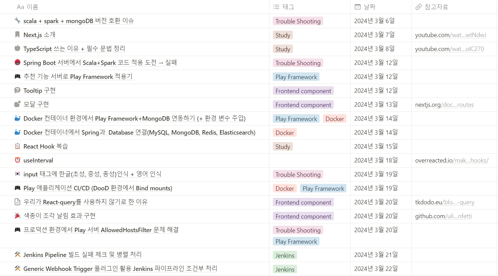
</div>

### **조현수**<br>
- 
### **송윤재**<br>
- 
### **오형택**<br>
- 
### **조용환**<br>
- 
### **전형욱**<br>
- 
### **노세희**<br>
-