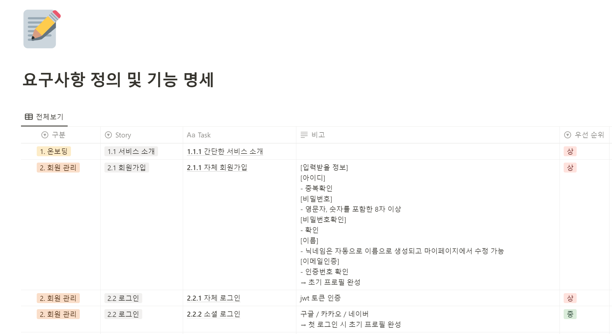

# pick IT up (사용자 맞춤형 채용 공고 추천 서비스✨)

### 💙 SSAFY 10기 특화 프로젝트 서울 4반 🐥F5 세희고침🐥 (2024.2.17 ~ 2024.04.04)


# 📚 목차

##### 1️⃣ [서비스 소개](#Ⅰ.-서비스-소개-🎈)

##### 2️⃣ [기획 배경](#Ⅱ-기획-배경-☁️)

##### 3️⃣ [팀원 및 일정](#Ⅲ-팀원-및-일정-소개-🐥)

##### 4️⃣ [서비스 화면](#Ⅳ-서비스-화면-💻)

##### 5️⃣ [개발 환경](#Ⅴ-개발-환경-🖥)

##### 6️⃣ [활용 기술](#Ⅵ-활용-기술-)

##### 7️⃣ [프로젝트 산출물](#Ⅶ-프로젝트-산출물-)

##### 8️⃣ [개발 회고](#Ⅷ-개발-회고-)

<br/>

# Ⅰ. 서비스 소개 🎈

### 📌 Overview

- 사용자 데이터 기반 IT 채용 공고를 추천해주고, 더 나아가서 해당 직군에 필요한 기술 블로그 추천

### 🎯 타겟

- 기술 스택 기반으로 IT 채용 공고를 보고 싶은 취준생들
- 너무 많은 정보량으로 힘들어하는 추천이 필요한 취준생들
- 기술 면접 대비를 하고 싶은 사람들
- 자기소개서를 관리하고 싶은 취준생, 이직생들

### 📌 프로젝트 기능

### 📌 서비스 구현(✅ : 구현 완료 ❌ : 미구현)

#### 1️. 기본기능 ✅

#### 2️. 추가기능 ✅

#### 3️. 심화기능 ⚠️

</br>

# Ⅱ. 기획 배경 ☁️

- IT 직군 취업 준비생들의 관심 분야에 따른 다양한 취업 공고를 확인하기 쉽지 않음.

- IT 산업은 **빠르게 변화**하며 **새로운 기술과 트렌드**가 지속적으로 등장
  취업을 준비하는 사람들은 **관련 뉴스, 기술 개발 업데이트, 업계 동향 등을 지속적으로 추적**해야 하는 필요성 존재
  유용한 정보를 찾아내고 이를 자신의 취업 준비 과정에 효과적으로 활용하는 것은 쉽지 않음

### ✅ 서비스 설명

- 사용자 데이터 기반 IT 채용 공고를 추천해주고, 더 나아가서 해당 직군에 필요한 기술 블로그 추천

# Ⅲ. 팀원 및 일정 소개 🐥

## 📆 프로젝트 기간

### 24.02.19 ~ 24.04.04

- 기획 및 설계 : 24.02.19 ~ 24.02.28
- 프로젝트 구현 : 24.02.28 ~ 24.04.01
- 버그 수정 및 산출물 정리 : 24.04.01 ~ 24.04.04
- 코드 리팩토링 : 24.04.04 ~

<br />

<table>
    <tr>
        <td height="140px" align="center"> <a href="https://github.com/hyunsoo10">
             <br><br> 👑 조현수 <br>(Back-End) </a> <br></td>
        <td height="140px" align="center"> <a href="https://github.com/Song-YoonJae">
             <br><br> 👶🏻 송윤재 <br>(Back-End) </a> <br></td>
        <td height="140px" align="center"> <a href="https://github.com/HyeongtaekOh">
             <br><br> 👶🏻 오형택 <br>(Back-End) </a> <br></td>
        <td height="140px" align="center"> <a href="https://github.com/yhc-key">
            
            <br><br> 👶🏻 조용환 <br>(Front-End) </a> <br></td>
        <td height="140px" align="center"> <a href="https://github.com/hyeounguk2">
             <br><br> 👶🏻전형택 <br>(Front-End) </a> <br></td>
        <td height="140px" align="center"> <a href="https://github.com/se2develop">
             <br><br> 👶🏻 노세희 <br>(Front-End) </a> <br></td>
    </tr>
    <tr>
        <td align="center"><br/></td>
        <td align="center"><br/></td>
        <td align="center"><br/></td>
        <td align="center"><br/><br/><br/></td>
        <td align="center"><br/></td>
        <td align="center"><br/></td>
    </tr>
</table>

# Ⅳ. 서비스 화면🎬

## 기능 소개 🎬

#### 로그인 및 회원가입

<div style="display: flex;">


</div>

#### 채용공고

<div align="start">

</div>

#### 추천공고

<div align="start">

</div>

#### 미니게임

<div align="start">

</div>

##### speedQuiz

<div style="display: flex;">


</div>

##### OXQuiz

<div style="display: flex;">


</div>

#### 면접대비

<div style="display: flex;">


</div>

#### 마이페이지

##### 내가 찜한 채용 공고

<div align="start">

</div>

##### 나의 뱃지

<div align="start">

</div>

##### 과거 답변 내역

<div align="start">

</div>

##### 자소서 관리

<div align="start">

</div>

##### 개인 정보 수정

<div align="start">

</div>

## 시연 영상 🎬

# Ⅴ. 개발 환경 🖥

## 🖱 Frontend


<br>

#### 상세 스택

    VScode 2023.3.4
    Version: 1.86.2 (user setup)
    Node.js: 18.17.1
    V8: 11.8.172.18-electron.0
    TypeScript : ^5
    Nextjs : 14.1.1
    react: ^18
    tailwindcss: ^3.3.0
    @tanstack/react-query: ^5.28.6
    tailwindcss: ^3.3.0

#### 기술 스택 선택 이유

- Nextjs: 이미지 최적화, SEO를 고려한 SSR 제작, 편리한 routing, 데이터 캐싱
- TypeScript : 타입 에러를 잡아내 디버깅 시간을 줄이기 위해 사용
- Tanstack query : 검색 기능 속 Infinite scroll 구현 때 간편하게 검색어별 데이터를 쿼리키로 캐싱 및 Infnnite scroll 구현을 도와주기 때문에 사용
- Tailwind CSS: 간편한 CSS 문법 제공 및 코드 길이를 짧게 해줌
- Zustand: Redux, redux-toolkit보다 러닝 커브가 낮고, 전역 상태관리가 필요한 영역이 적고, 1.2kb 로 패키지가 가벼워서 사용

## 🖱 Backend


<br>

#### 상세 스택

    IntelliJ 2023.3.4
    SpringBoot 3.2.3
    Gradle 8.5
    Lombok 1.18.16
    Hibernate 3.2.1
    Swagger 4.18.2
    Spring Security 6.2.2
    Python 3.12.2
    Jupyter notebook 버전작성
    Scala 2.12.16 ( + openJDK-8u342 )
    sbt 1.7.2
    Play Framework 2.8.21
    Spark 3.0.2
    mongo-spark-connector 3.0.2

## 🖱 CI/CD


#### 상세 스택

    docker 25.0.4
    docker-compose 2.21.0
    jenkins LTS 2.440.1

<br>

## 🎨 UI/UX


<br>

## 👨‍👩‍👧 협업 툴

- <strong>형상 관리<br>
  
  

- <strong>이슈 관리<br>
  

- <strong>커뮤니케이션<br>
  
  
  
  <br>

# Ⅵ. 활용 기술 🧰

## 🖱 Frontend

- NextJS 활용 SEO를 고려한 SSR방식 웹사이트 제작
- NextJS 활용 데이터 캐싱으로 UX 향상
- Zustand를 활용해 전역 상태 관리
- React-query를 활용해 검색 기능 Infinite Scroll 구현
- refreshToken과 accessToken으로 로그인 로직 구현

## 🖱 Backend

## 1.MySQL Master-Slave

MySQL을 Master DB와 Slave DB로 나누어서 분산 환경을 구축했습니다.

DB 분산 환경을 통해 Master DB에 장애가 발생하더라도 Slave DB를 활용해서 복구할 수 있도록 했습니다.

또한, 읽기 작업을 Slave DB로 분산시켜서 서비스의 응답을 향상시키고 대규모 트래픽에 대응할 수 있도록 했습니다. 사용자 상호작용 데이터가 쌓이는 쓰기 작업이 DB에 부하를 줄 수 있기 때문에, 읽기 작업을 Slave DB에서 전담하도록 했습니다.

그리고 읽기와 쓰기 작업을 분리하였기 때문에 스프링 프로젝트에서도 CQRS 패턴을 통해 Command 작업과 Query 작업을 구분해서 작업하였습니다.

시스템의 가용성과 성능을 향상 시킬 수 있으며 CQRS 패턴과 결합을 통해 시스템의 확장성을 높일 수 있어서 개발 및 운영 측면에서 많은 이점을 누릴 수 있는 기술이라고 생각합니다.

# Ⅶ. 프로젝트 산출물 📁

### 🏛 서비스 아키택처

<div align="start">

</div>

### 🛢︎ ERD

<div align="start">

</div>



### 📄 API 명세서


### 🎨 화면 설계서

<div align="start">

</div>

# Ⅷ. 개발 회고 🔎

## 📌코드 컨벤션

### Front-end

https://www.notion.so/Front-End-59a0c5e4788245a985c65521dc8dff8a

### Back-end

https://www.notion.so/Back_End-2e25f8e764d84d929aaf5dfc0a23ba27

## 📌커밋 RULE

```
✨Feat : 새로운 기능 추가
🐛Fix : 버그 수정
📝Docs : 문서 수정
🗃️Style : 코드 포맷팅, 세미콜론 누락, 코드 변경이 없는 경우
♻️Refactor : 코드 리펙토링
✅Test : 테스트 코드, 리펙토링 테스트 코드 추가
💡Comment : 필요한 주석 추가 했을 경우
🎨Design : css나 디자인 변경, 이미지 추가 등
🚑Hotfix : 치명적인 버그 수정
👷Build : 배포 관련
```

### **👻 조현수**<br>

### **👻 송윤재**<br>

### **👻 오형택**<br>

### **👻 조용환**<br>

### **👻 전형욱**<br>

### **👻 노세희**<br>

```

```
