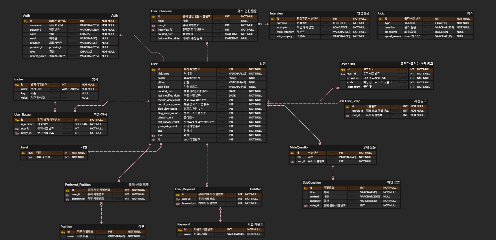

## 중간발표 산출물

### 1. [기획서](https://cheddar-cloudberry-278.notion.site/pick-IT-up-8d59c237d3af488a9b6be0865ab401cf)

### 2. [기능정의서](https://cheddar-cloudberry-278.notion.site/04dd0a6fc020411da956b971ae7c1979?pvs=74)

### 3. [API 명세서](https://cheddar-cloudberry-278.notion.site/API-93984df81dd345d0bca02f77572e75e8?pvs=74)

### 4. 화면 정의서
- 산출물 폴더에 pdf 파일로 저장

### 5. [와이어 프레임](https://www.figma.com/file/AlcgDU0rh95PABatRzry87/%F0%9F%93%B0?type=design&node-id=0%3A1&mode=design&t=gbRHzogEl4S1MhbH-1)

### 6. 서비스 아키텍처

### 7. ERD

### 8. 시퀀스다이어그램

